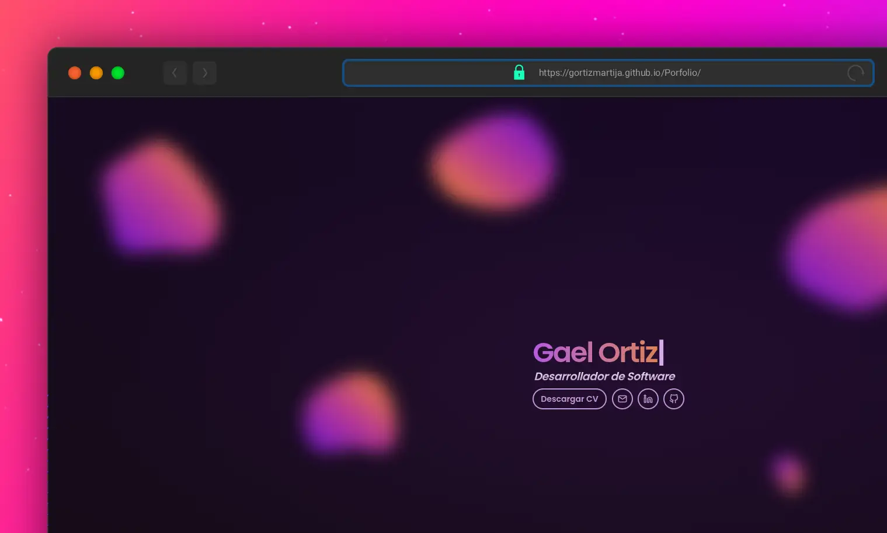

# 🌐 Gael Ortiz – Portfolio

<div align="center">
  <h3>Desarrollador de Software Full Stack</h3>
  <p>Construyendo experiencias web modernas y atractivas</p>
  
  [](https://gortizmartija.github.io/Porfolio/)


</div>

---

## 🎯 Visión General

Bienvenido a mi portfolio personal, una **experiencia web inmersiva** desarrollada con tecnologías modernas. Este proyecto no es solo una muestra de mi trabajo, sino también un reflejo de mi pasión por crear interfaces elegantes y funcionales.

### ⚡ Highlights

- 🎨 **Diseño Minimalista y Elegante**
- 💫 **Animaciones Fluidas con GSAP**
- 🚀 **Rendimiento Optimizado**
- 📱 **Experiencia Responsive**
- ♿ **Accesibilidad Prioritaria**

---

## �️ Stack Tecnológico

### Frontend

- ⚛️ **React 18** – Librería principal para la interfaz
- ⚡ **Vite** – Build system y desarrollo local
- 🎨 **Tailwind CSS** – Utilidades CSS y diseño responsive
- 🌀 **GSAP** – Animaciones profesionales
- 🔍 **ESLint + Prettier** – Calidad y formato de código

### Performance

- 📦 **Code Splitting**
- 🖼️ **Lazy Loading**
- 🎯 **Asset Optimization**
- ⚡ **Prefetching**

### DevOps

- 🚀 **Github Pages** – Despliegue automático
- 📊 **Lighthouse CI** – Métricas de rendimiento

---

### 🎭 Diseño y UX

- 💫 **Animaciones GSAP Avanzadas**

  ```jsx
  // Efecto de hover en botones
  const buttonEffect = {
    scale: 1.05,
    duration: 0.3,
    ease: 'power2.out',
  };
  ```

- 🎨 **Componentes Interactivos**
  - Tabs animadas
  - Tarjetas de proyecto con hover
  - Galería de tecnologías

### 🏗️ Arquitectura

- 📦 **Componentes Modulares**

  ```jsx
  // Ejemplo de componente reutilizable
  <Button variant='primary' withHoverEffect aria-label='Ver proyecto'>
    Explorar
  </Button>
  ```

---

## 🚀 Quick Start

1. **Clona el repositorio**

   ```bash
   git clone https://github.com/gortizmartija/Porfolio.git
   ```

2. **Instala dependencias**

   ```bash
   pnpm install
   ```

3. **Inicia el servidor de desarrollo**
   ```bash
   pnpm dev
   ```

## 🤝 Contacto

¿Interesado en colaborar o tienes alguna pregunta? ¡Contáctame!

[](https://www.linkedin.com/in/gortizmartija)
[](https://github.com/gortizmartija)
[](mailto:gortizmartija@gmail.com)

---

<div align="center">
  <p>⭐ Si te gusta este proyecto, ¡no dudes en darle una estrella!</p>
  
  [](https://opensource.org/licenses/MIT)
  
  
</div>
